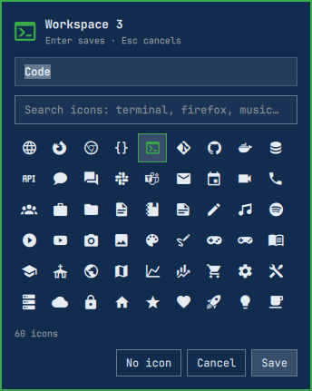

# Workspace Nameplates

An Omarchy bar widget that replaces the stock workspace numbers **in place**.
Each workspace keeps its number and gains a name and an icon:


Other workspace plugins add a second widget somewhere else on the bar, or
swap the number for a name. This one takes over the left-hand slot of
`omarchy.workspaces` and keeps the number, so `SUPER+3` still goes to the
workspace labeled 3.

## Features

- **Number + name + icon** for every workspace, in the stock widget's spot.
- **Double-click to edit.** Double-click a workspace (or right-click it) to
  rename it and choose an icon. Changes save to `shell.json` and appear
  immediately.
- **Searchable icon picker.** Search about 10,000 Nerd Font glyphs by name,
  e.g. "terminal", "firefox" or "church"; no copy-pasting of glyphs.
- **Behaves like the stock widget.** Click to switch, scroll to cycle. Empty
  workspaces are dimmed. The focused workspace is shown in your theme's
  accent color with an underline.
- **Theme aware.** Colors, font and spacing come from your Omarchy theme.
  Vertical bars show just the icon.



In the editor, **Enter** saves, **Esc** cancels and **Tab** moves between the
name and icon search fields. Pressing Enter in the search field picks the
first match. Double-click an icon to pick it and save in one step.

## Install

Review the source first. Like every Omarchy plugin, it runs unsandboxed
inside `omarchy-shell`. Then:

```bash
omarchy plugin add https://github.com/jburchel/omarchy-workspace-nameplates.git
```

When asked, accept the prompt to enable the plugin and choose the **left**
section, which is preselected. Then put it first in that section and turn off
the stock numbers, so it sits in the stock widget's place:

```bash
omarchy plugin enable io.github.jburchel.workspace-nameplates --section left --index 0
omarchy plugin disable omarchy.workspaces
```

Then double-click any workspace to give it a name and an icon.

## Update

```bash
omarchy plugin update io.github.jburchel.workspace-nameplates
```

## Remove

Put the stock widget back, then remove the plugin:

```bash
omarchy plugin enable omarchy.workspaces --section left --index 0
omarchy plugin remove io.github.jburchel.workspace-nameplates
```

If you added the optional keybinding, remove it from `bindings.lua`.

> **Note:** Disabling or removing the widget deletes its entry in
> `shell.json`, including the names and icons you set. Copy the entry first
> if you want to keep them.

## Requirements

- Omarchy 4 (Quattro shell). Tested on Omarchy 4.0.4 with Hyprland 0.56.
- A Nerd Font for the bar. Omarchy's default, JetBrainsMono Nerd Font, works.

There are no other dependencies. The plugin makes no network requests, needs
no sudo and has no install hooks. It writes only its own entry in
`~/.config/omarchy/shell.json`, and only when you press Save in the editor.

## Configuration

The editor writes everything for you. If you prefer, you can edit the same
entry by hand:

```json
{
  "id": "io.github.jburchel.workspace-nameplates",
  "format": "{number} {name} {icon}",
  "verticalFormat": "{icon}",
  "workspaces": {
    "1": { "name": "Web",  "icon": "󰈹" },
    "2": { "name": "Code", "icon": "󰨞" }
  }
}
```

| Key | Default | Meaning |
| --- | --- | --- |
| `format` | `"{number} {name} {icon}"` | Label layout on horizontal bars. Try `"{number}:{name}"` or `"{icon} {number}"`. |
| `verticalFormat` | `"{icon}"` | Label layout on left/right bars. Falls back to the number when the result is empty. |
| `workspaces` | `{}` | Per-workspace `name` and `icon`, keyed by workspace number (`"10"` is shown as 0). |
| `persistent` | 1–5 plus every named workspace | Array of workspace numbers that are always shown, even when empty. Occupied workspaces are always shown. |

## Keybinding

To open the editor for the current workspace from the keyboard, add this to
`~/.config/hypr/bindings.lua` (pick any free key):

```lua
o.bind("SUPER + CTRL + N", "Rename workspace", "omarchy-shell io.github.jburchel.workspace-nameplates edit 0")
```

`edit <n>` opens the editor for workspace *n* on the focused monitor, and
`edit 0` opens it for the current workspace. The shell registers this IPC
command only at startup, so run `omarchy restart shell` once after installing
if you want to use it. Double-click editing works without a restart.

## Tests

```bash
node tests/qml-text.test.js   # every Text item renders plain text
```

## Credits

Icon names come from the [Nerd Fonts](https://www.nerdfonts.com) glyph index
(MIT). The widget is adapted from Omarchy's stock `omarchy.workspaces`.

## License

MIT
